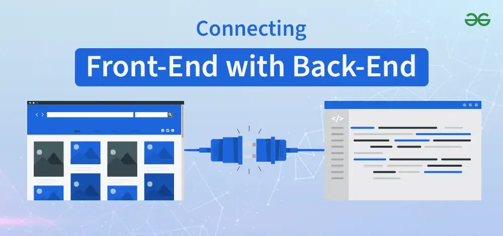
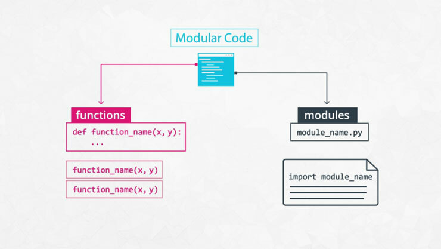
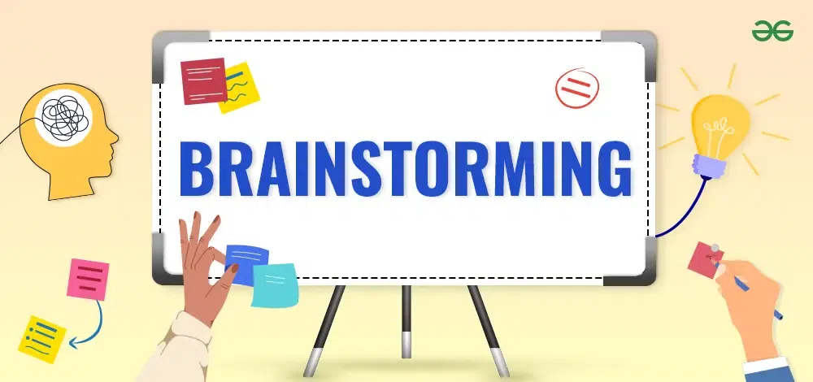

# Conflict between **Frontend and Backend**

## Backend developer has to **reroutes url everytime frontend design changes**.

---

## Frontend developer has to **juggle multiple conflicted requests from multiple teachers**.

---

## Due to deadline closer, these conflicts are **critical and needed to resolves as soon as possible**.

---

## Conflicts arises due to

1. Changes in frontend affects backend.
2. Multiple ambiguous and conflicted requests

---

# Solutions

## Extends deadline

1. Improves work quality
2. Boosts morale and reduces burnout
3. Enhances problem-solving
4. maintain positivie relationships

---

## Simplify redesigns by using modularity

1. Reduce Complexity
2. Better estimation
3. Enhanced Flexibility and scalability

---

## Adding new team members

1. Workload Redistribution
2. free up senior devs for high-priority work

---

## Centralize Communication Channels

1. Funnel all requests through a single point
2. Use structured formats like task boards or issue trackers to reduce ambiguity

---

## Effective Communication Strategies Used

### Team collaboration

### Active listening communication

### Brainstorming

### Empathic listening▬

### Discussing

---

## Debrief

### Fair distribution workload

---

### Really listening to concerns

---

### Empathetic listening

---
